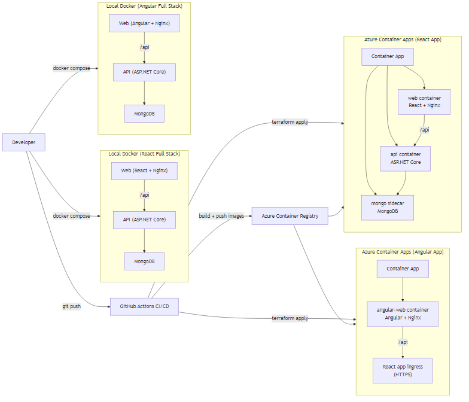

# ReactFullStackDemo

Full-stack demo (React + ASP.NET Core + MongoDB). This phase contains the API and the standalone frontend.

## Local API (Docker)

```bash
docker compose -f infra/docker-compose.api.yml up -d --build
```

API: `http://localhost:5069`
Health: `http://localhost:5069/api/health`

## Local API (CLI)

```bash
dotnet run --project src/ReactFullStackDemo.Api
```

## Tests

```bash
dotnet test ReactFullStackDemo.slnx -c Release
```

## Frontend (Local Dev)

```bash
cd src/ReactFullStackDemo.Web
npm install
npm test
npm run dev
```

Vite dev server: `http://localhost:5173`

## Angular Frontend (Local Dev)

```bash
cd src/AngularFullStackDemo.Web
npm install
npm start
```

Angular dev server: `http://localhost:4200`

## React Frontend (Docker)

```bash
docker compose -f infra/docker-compose.web.yml up -d --build
```

Web: `http://localhost:8080`

Note: `/api` is proxied to the `api` container. For a full stack run, use the compose file below.

## React Full Stack (Docker)

```bash
docker compose -f infra/docker-compose.full.yml up -d --build
```

Web + API via Nginx: `http://localhost:8080`
Health: `http://localhost:8080/api/health`

## Angular Full Stack (Docker)

```bash
docker compose -f infra/docker-compose.angular.full.yml up -d --build
```

Angular Web + API via Nginx: `http://localhost:8081`
Health: `http://localhost:8081/api/health`

## Angular Frontend (Docker)

```bash
docker compose -f infra/docker-compose.angular.web.yml up -d --build
```

Angular Web: `http://localhost:8081`

## Angular Frontend (Docker, reuse React backend)

```bash
docker compose -p angular -f infra/docker-compose.angular.web.local.yml up -d --build
```

Angular Web: `http://localhost:8081`
Backend: `http://localhost:5069` (from `infra/docker-compose.full.yml`)

## Azure (Terraform + Container Apps)

This deploys a single Container App with three containers: `web`, `api`, and a MongoDB sidecar.

1. Authenticate
```bash
az login
```

2. Bootstrap Terraform state storage (one-time)
```bash
cd infra/bootstrap
terraform init
terraform apply
```

3. Provision infrastructure
```bash
cd infra/terraform
terraform init
terraform apply
```

4. Build and push images
```bash
az acr login -n <acr-name-from-output>
docker build -t <acr-login-server>/react-fullstack-demo-api:v1 -f src/ReactFullStackDemo.Api/Dockerfile .
docker push <acr-login-server>/react-fullstack-demo-api:v1
docker build -t <acr-login-server>/react-fullstack-demo-web:v1 -f src/ReactFullStackDemo.Web/Dockerfile .
docker push <acr-login-server>/react-fullstack-demo-web:v1
```

5. Deploy the images
```bash
cd infra/terraform
terraform apply -var="api_image_tag=v1" -var="web_image_tag=v1"
```

6. Get the URL
```bash
terraform output container_app_url
terraform output angular_app_url
```

## Architecture Diagrams

- English: `docs/architecture-en.md`
- 中文（本地版本，不提交）：`docs/architecture-zh.md`


