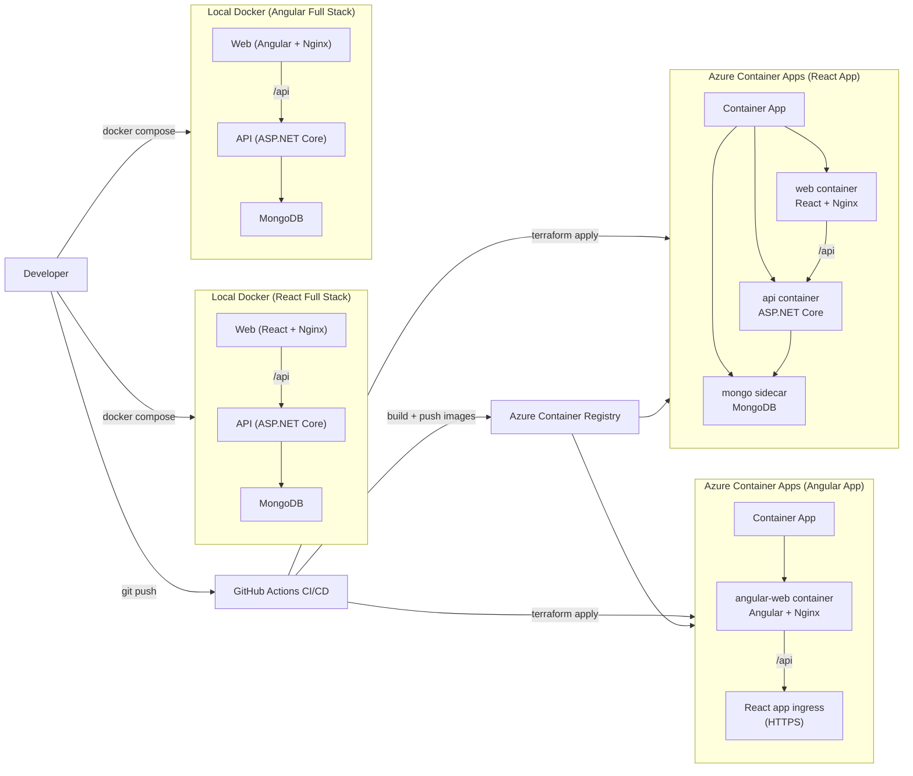

# System Architecture (EN)

```mermaid
flowchart LR
  subgraph LocalReact["Local Docker (React Full Stack)"]
    RWeb["Web (React + Nginx)"]
    Api["API (ASP.NET Core)"]
    Db["MongoDB"]
    RWeb -->|/api| Api
    Api --> Db
  end

  subgraph LocalAngular["Local Docker (Angular Full Stack)"]
    AWeb["Web (Angular + Nginx)"]
    Api2["API (ASP.NET Core)"]
    Db2["MongoDB"]
    AWeb -->|/api| Api2
    Api2 --> Db2
  end

  subgraph AzureReact["Azure Container Apps (React App)"]
    AcaReact["Container App"]
    AcaWeb["web container\nReact + Nginx"]
    AcaApi["api container\nASP.NET Core"]
    AcaMongo["mongo sidecar\nMongoDB"]
    AcaReact --> AcaWeb
    AcaReact --> AcaApi
    AcaReact --> AcaMongo
    AcaWeb -->|/api| AcaApi
    AcaApi --> AcaMongo
  end

  subgraph AzureAngular["Azure Container Apps (Angular App)"]
    AcaAngular["Container App"]
    AcaAngularWeb["angular-web container\nAngular + Nginx"]
    AcaAngular --> AcaAngularWeb
    AcaAngularWeb -->|/api| AcaApiIngress["React app ingress\n(HTTPS)"]
  end

  Dev["Developer"] -->|docker compose| LocalReact
  Dev -->|docker compose| LocalAngular
  Dev -->|git push| CI["GitHub Actions CI/CD"]
  CI -->|build + push images| ACR["Azure Container Registry"]
  CI -->|terraform apply| AzureReact
  CI -->|terraform apply| AzureAngular
  ACR --> AzureReact
  ACR --> AzureAngular
```
