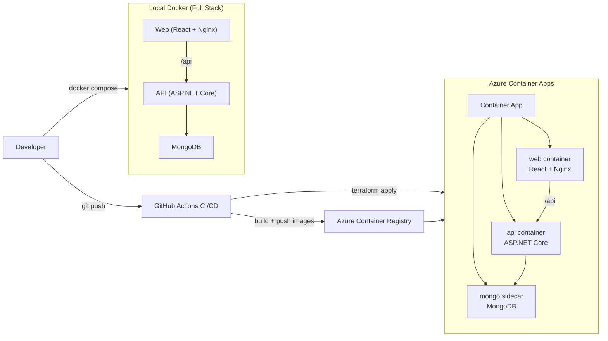

# System Architecture (EN)

```mermaid
flowchart LR
  subgraph Local["Local Docker (Full Stack)"]
    Web["Web (React + Nginx)"]
    Api["API (ASP.NET Core)"]
    Db["MongoDB"]
    Web -->|/api| Api
    Api --> Db
  end

  subgraph Azure["Azure Container Apps"]
    Aca["Container App"]
    AcaWeb["web container\nReact + Nginx"]
    AcaApi["api container\nASP.NET Core"]
    AcaMongo["mongo sidecar\nMongoDB"]
    Aca --> AcaWeb
    Aca --> AcaApi
    Aca --> AcaMongo
    AcaWeb -->|/api| AcaApi
    AcaApi --> AcaMongo
  end

  Dev["Developer"] -->|docker compose| Local
  Dev -->|git push| CI["GitHub Actions CI/CD"]
  CI -->|build + push images| ACR["Azure Container Registry"]
  CI -->|terraform apply| Azure
  ACR --> Azure
```
